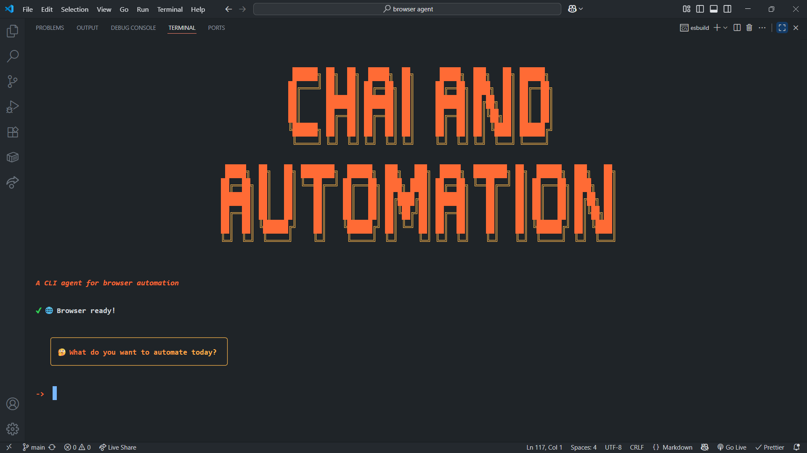

# Chai and Automation

A powerful browser automation agent powered by LLMs and Playwright, designed to simplify web automation tasks through natural language instructions.



## 🌟 Features

- **Natural Language Control**: Automate browser tasks using simple English instructions
- **Visual UI Analysis**: Automatically identifies and interacts with web page elements
- **Smart Form Filling**: Intelligently fills out forms based on your instructions
- **Interactive CLI**: Beautiful command-line interface with real-time progress indicators
- **Error Handling**: Built-in error recovery and user prompting when needed

## 🚀 Quick Start

### Prerequisites

- Node.js (v18 or higher)
- npm or yarn

### Installation

1. Clone this repository

```bash
git clone https://github.com/PiyushRepos/browser-agent.git
cd browser-agent
```

2. Install dependencies

```bash
npm install
```

3. Configure environment variables

```bash
# Copy the example env file
cp .env.example .env

# Edit .env file with your API keys
```

4. Set up your `.env` file with:

```
GEMINI_BASE_URL=https://api.gemini.com/v1  # Or your specific API endpoint
GEMINI_API_KEY=your_api_key_here
GEMINI_MODEL_NAME=gemini-pro  # Or your preferred model
```

### Running the Agent

```bash
npm start
```

## 🤖 Usage Examples

When prompted, simply describe what you want to automate in natural language:

```
✔ What do you want to automate today? › Go to https://example.com/signup and register a new account with the username "testuser123" and email "test@example.com"
```

Other example commands:

- "Go to Gmail and check my unread messages"
- "Navigate to Amazon and search for wireless headphones under $100"
- "Fill out the contact form on https://example.com/contact with my information"
- "Log into my GitHub account"

## 🔧 Tools and Capabilities

The agent comes with several built-in tools for browser automation:

| Tool                      | Description                                              |
| ------------------------- | -------------------------------------------------------- |
| **navigate**              | Go to any URL                                            |
| **extract_page_elements** | Analyze page structure and identify interactive elements |
| **clickOnElement**        | Click any element on the page                            |
| **type**                  | Type text into input fields                              |
| **wait**                  | Wait for specified milliseconds                          |
| **scroll**                | Scroll the page horizontally or vertically               |
| **take_screenshot**       | Capture screenshots for debugging                        |
| **ask_user**              | Interactive prompts for additional information           |

## 📋 System Requirements

- **Node.js**: v18 or higher
- **Memory**: 4GB+ recommended
- **OS**: Windows, macOS, or Linux

## 🧩 Technologies Used

- **[Playwright](https://playwright.dev/)**: Browser automation
- **[@openai/agents](https://www.npmjs.com/package/@openai/agents)**: Agent framework
- **[Zod](https://github.com/colinhacks/zod)**: Runtime type validation
- **[Chalk](https://github.com/chalk/chalk)**, **[Ora](https://github.com/sindresorhus/ora)**, **[Boxen](https://github.com/sindresorhus/boxen)**: Terminal UI
- **[CFonts](https://github.com/dominikwilkowski/cfonts)**: Console fonts for the CLI banner

## 🔒 Security Notes

- The agent runs a visible browser instance for transparency
- No browser data is stored between sessions
- API keys are stored locally in your `.env` file

## 🤝 Contributing

Contributions are welcome! Please feel free to submit a Pull Request.

## 📝 License

This project is licensed under the ISC License - see the LICENSE file for details.
